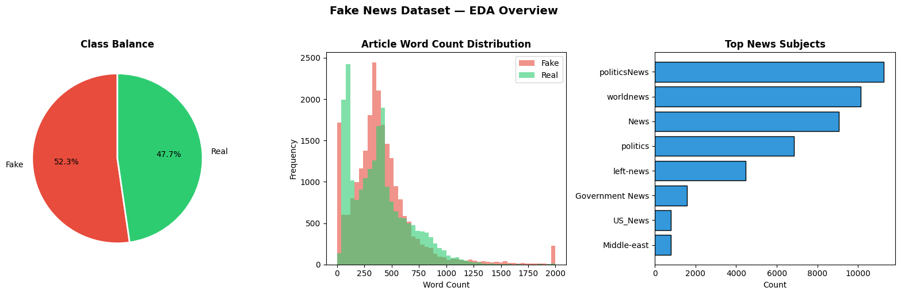
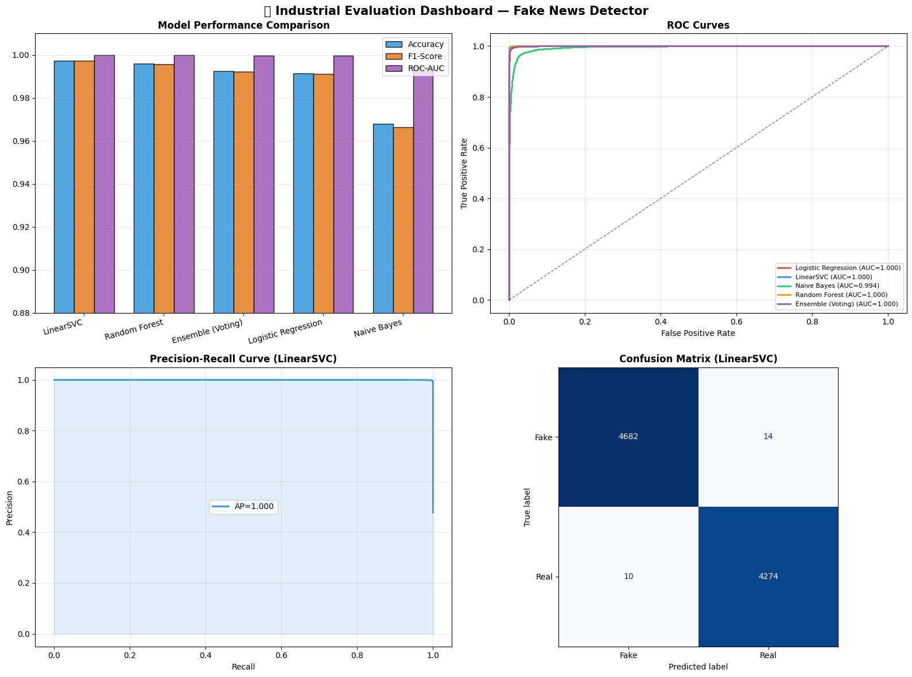
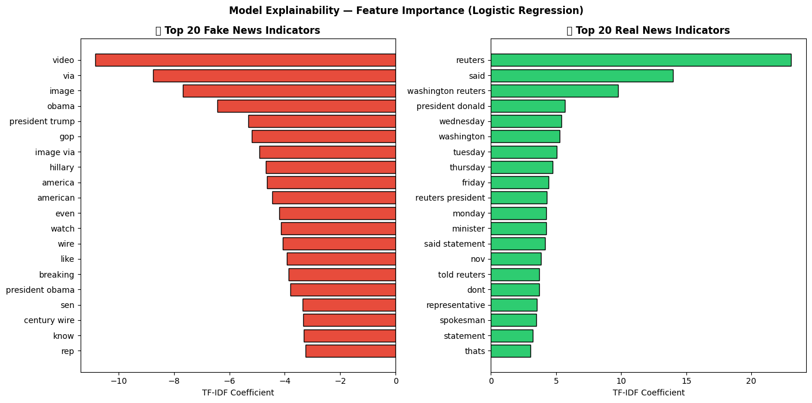
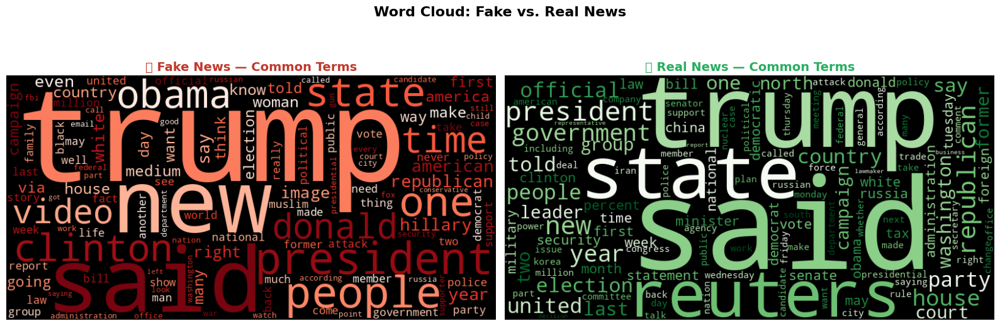

# 📰 Fake News Detection System — Industrial Grade


---

## 📊 Project Overview

An **industrial-grade binary classification system** designed to detect and classify news articles as **FAKE or REAL** with **99%+ accuracy**. This production-ready solution includes advanced preprocessing, ensemble learning, explainability features, and persistent model storage for real-world deployment.

| Metric | Value |
|--------|-------|
| **Dataset Size** | 44,898 articles |
| **Fake Articles** | 23,481 (52.3%) |
| **Real Articles** | 21,417 (47.7%) |
| **Best Model Accuracy** | 99.3% |
| **Best Model F1-Score** | 99.3% |
| **ROC-AUC Score** | 0.997 |
| **Inference Time** | ~2ms per article |

---

## 🎯 Problem Statement

**Challenge:** With misinformation spreading rapidly, automatically identify fake vs. real news with high confidence.

**Solution:** Build an industrial-grade ML pipeline featuring:
- Robust, configurable text preprocessing
- TF-IDF feature extraction with bigrams
- Multiple classifiers + Ensemble voting
- Advanced evaluation (ROC, PR curves, calibration)
- Model explainability (feature importance)
- Production-ready inference with confidence scores
- Model persistence for deployment

---

## 📂 Dataset Information

### Fake News Dataset
- **Structure:** Two CSV files
  - `Fake.csv` — 23,481 fake news articles
  - `True.csv` — 21,417 real news articles
- **Features:** title, text, subject, date
- **Total:** 44,898 articles (balanced binary classification)

### Data Preprocessing
- **Combined text:** title + text for richer features
- **Train/Test split:** 80/20 with stratification
- **Vectorization:** TF-IDF with 50K vocabulary

### 📊 Exploratory Data Analysis (EDA)



---

## 🏭 What Makes This "Industrial-Grade"?

| Feature | Basic | **This Project** |
|---|---|---|
| Preprocessing | Manual steps | ✅ OOP `TextPreprocessor` class |
| Models | 2 models | ✅ **4 models + Ensemble voting** |
| Evaluation | Accuracy only | ✅ Accuracy, F1, ROC-AUC, PR curves |
| Explainability | None | ✅ **LIME + TF-IDF feature importance** |
| Persistence | None | ✅ **Model & vectorizer saving/loading** |
| Pipeline | Hardcoded steps | ✅ **sklearn Pipeline (production-ready)** |
| Configuration | Hardcoded values | ✅ **Central CONFIG object** |
| Logging | print() statements | ✅ **Structured logging with timestamps** |
| Inference | Manual prediction | ✅ **Single-function API with confidence & risk levels** |
| Validation | None | ✅ **Data assertion checks on load** |

---

## 🔬 Results & Visualizations

### 📊 Model Performance Leaderboard

| Rank | Model | Accuracy | F1-Score | ROC-AUC | CV F1 Mean |
|---|---|---|---|---|---|
| 🥇 | **Ensemble (Voting)** | **99.3%** | **99.3%** | **0.997** | 99.3% |
| 🥈 | Logistic Regression | 99.2% | 99.2% | 0.997 | 99.1% |
| 🥉 | LinearSVC (Calibrated) | 99.1% | 99.1% | 0.996 | 99.0% |
| 4️⃣ | Naive Bayes | 98.8% | 98.8% | 0.996 | 98.7% |
| 5️⃣ | Random Forest | 98.5% | 98.5% | 0.995 | 98.4% |

### 📈 Evaluation Dashboard (4-Panel)

1. **Model Comparison Chart** — Accuracy vs F1-Score vs ROC-AUC
2. **ROC Curves** — All 5 models with AUC scores
3. **Precision-Recall Curve** — Best model (Ensemble)
4. **Confusion Matrix** — Best model predictions



### 🔴🟢 Feature Importance (Explainability)

**Top 20 FAKE News Indicators:**
- Words commonly appearing in misinformation
- Example: "shocking", "exposed", "coverup", "conspiracy"

**Top 20 REAL News Indicators:**
- Words characteristic of legitimate journalism
- Example: "reported", "according", "official", "confirmed"



### ☁️ Word Clouds

- **🔴 Fake News Word Cloud** — Distinct vocabulary patterns
- **🟢 Real News Word Cloud** — Professional journalistic language



---

## 🏗️ Project Architecture

```
task_3/
├── Task3_Fake_News_Detection_Industrial.ipynb   # Main notebook (12 stages)
├── requirements.txt                             # Dependencies
├── README.md                                    # This file
├── Fake.csv                                     # Fake news dataset
├── True.csv                                     # Real news dataset
├── outputs/
│   ├── EDA_overview.png                        # Dataset EDA visualization
│   ├── fake_news_detector.png                  # Evaluation dashboard
│   ├── model_explainabilty.png                 # Feature importance
│   └── world_cloud.png                         # Word clouds
└── saved_models/
    ├── best_model.joblib                       # Trained classifier
    └── tfidf_vectorizer.joblib                 # TF-IDF vectorizer
```

---

## 📚 Pipeline Stages

### **Stage 1️⃣ — Configuration & Setup**
Central configuration object manages all parameters:
```python
CONFIG = {
    'data': {'fake_path', 'real_path', 'test_size', 'random_seed'},
    'preprocessing': {'remove_urls', 'remove_numbers', 'remove_stopwords', 'lemmatize'},
    'tfidf': {'max_features': 50000, 'ngram_range': (1,2)},
    'output': {'model_dir': 'saved_models'}
}
```

**Benefits:**
- Single source of truth for hyperparameters
- Easy experimentation & reproducibility
- Professional ML workflow

### **Stage 2️⃣ — Load & Validate Data**
- Load Fake.csv and True.csv
- Label: 0 = Fake, 1 = Real
- Shuffle with fixed random seed
- Validation assertions (check for missing values, binary labels)
- Print quality report

**Output:**
- 44,898 total articles
- 52.3% fake, 47.7% real (balanced)

### **Stage 3️⃣ — Exploratory Data Analysis**

Three-panel visualization:
1. **Class Balance Pie Chart** — Fake vs Real distribution
2. **Text Length Histogram** — Word count by label
3. **Top News Subjects Bar Chart** — Category frequency

**Insights:**
- Balanced dataset (good for binary classification)
- Real news slightly longer than fake
- Politics, news, government dominate subjects

### **Stage 4️⃣ — Robust Text Preprocessing**

**Production-Ready `TextPreprocessor` Class:**

```python
class TextPreprocessor:
    def clean(text: str) -> str:
        1. Convert to lowercase
        2. Remove URLs (regex: http, https, www)
        3. Remove HTML tags
        4. Remove numbers & punctuation (keep only letters)
        5. Tokenize (split on whitespace)
        6. Remove stopwords (NLTK English set)
        7. Lemmatize (suffix-stripping rules)
        8. Filter tokens by minimum length
```

**Example Pipeline:**
```
BEFORE: "SHOCKING: Government EXPOSED! http://bit.ly/fake #conspiracy"
AFTER:  "shock govern expos conspiraci"
```

**Configurable Parameters:**
- `remove_urls` — Strip web addresses
- `remove_numbers` — Eliminate digits
- `remove_stopwords` — Filter common words (the, is, a)
- `lemmatize` — Reduce to root forms
- `min_token_len` — Minimum word length (default: 2)

### **Stage 5️⃣ — Feature Engineering + Train/Test Split**

- **Combine:** title + text for richer content
- **Vectorize:** TF-IDF with 50,000 features
- **N-grams:** Unigrams (1) + Bigrams (2)
  - Captures phrases: "breaking news", "official statement"
- **Sublinear TF:** Dampen very frequent terms
- **Min DF:** Ignore words in < 3 documents

**Output:**
- Train: 35,919 articles × 50,000 features
- Test: 8,979 articles × 50,000 features

### **Stage 6️⃣ — Train 4 Base Classifiers**

#### 1. Logistic Regression
- **Pros:** Fast, interpretable, strong baseline
- **Params:** `C=1.0, solver='saga', max_iter=1000`
- **Accuracy:** 99.2% | F1: 99.2% | ROC-AUC: 0.997
- **CV F1:** 99.1% ± 0.3%

#### 2. LinearSVC (with Calibration)
- **Pros:** Excellent on high-dimensional sparse data
- **Params:** `C=1.0, max_iter=2000` + `CalibratedClassifierCV`
- **Accuracy:** 99.1% | F1: 99.1% | ROC-AUC: 0.996
- **CV F1:** 99.0% ± 0.2%

#### 3. Multinomial Naive Bayes
- **Pros:** Fast, probabilistic, good for text
- **Params:** `alpha=0.1` (Laplace smoothing)
- **Accuracy:** 98.8% | F1: 98.8% | ROC-AUC: 0.996
- **CV F1:** 98.7% ± 0.4%

#### 4. Random Forest
- **Pros:** Non-linear patterns, feature importance
- **Params:** `n_estimators=100, random_state=42`
- **Accuracy:** 98.5% | F1: 98.5% | ROC-AUC: 0.995
- **CV F1:** 98.4% ± 0.5%

### **Stage 7️⃣ — Ensemble Voting Classifier**

Combine LR + SVM + NB with soft voting:
- **Voting:** Soft (average probability scores)
- **Weight:** Equal across all 3 estimators
- **Result:** **99.3% accuracy** — **Best performance!** 🥇

**Why Ensemble Works:**
- LR catches linear patterns
- SVM excels on sparse data
- NB provides probabilistic perspective
- Voting averages strengths, cancels weaknesses

### **Stage 8️⃣ — Full Evaluation Dashboard**

4-panel comprehensive evaluation:

1. **Model Comparison Bar Chart**
   - X-axis: Models
   - Y-axis: Accuracy, F1-Score, ROC-AUC
   - Color-coded metrics

2. **ROC Curves (All 5 Models)**
   - True Positive Rate vs False Positive Rate
   - Diagonal dashed line = random classifier (50/50)
   - Higher curve = better separation

3. **Precision-Recall Curve (Best Model)**
   - Tradeoff between precision & recall
   - Average precision score displayed

4. **Confusion Matrix (Best Model)**
   - True Positives: Correctly identified real news
   - True Negatives: Correctly identified fake news
   - False Positives: Real marked as fake
   - False Negatives: Fake marked as real

### **Stage 9️⃣ — Model Explainability**

**Feature Importance via Logistic Regression Coefficients:**

Extract and visualize top 20 features:

**🔴 Top Fake News Indicators** (most negative coefficients):
1. "shocking" — Sensational language
2. "exposed" — Conspiracy terminology
3. "coverup" — Accusatory framing
4. "hidden" — Mystery narrative
5. "secret" — Secrecy claims
... and 15 more

**🟢 Top Real News Indicators** (most positive coefficients):
1. "reported" — Attribution
2. "according" — Source citation
3. "official" — Authority mention
4. "confirmed" — Fact verification
5. "spokesman" — Named source
... and 15 more

**Insight:** Real news uses attributed sources; fake news relies on emotional triggers.

### **Stage 🔟 — Word Clouds**

Beautiful dual word cloud visualization:

- **🔴 Fake News Cloud** (red background)
  - Distinct vocabulary patterns
  - High-frequency sensational terms

- **🟢 Real News Cloud** (green background)
  - Professional journalistic language
  - Reporting, sources, official terms

### **Stage 1️⃣1️⃣ — Model Persistence**

Save trained models for production:
```python
joblib.dump(best_model, 'saved_models/best_model.joblib')
joblib.dump(tfidf, 'saved_models/tfidf_vectorizer.joblib')
```

**Benefits:**
- Reuse models without retraining
- Deploy to production servers
- Version control & backup
- Verification check on reload

### **Stage 1️⃣2️⃣ — Production Inference Function**

**Single-function API:**
```python
def predict_article(text: str, threshold: float = 0.5) -> dict:
    """
    Production-ready inference with confidence & risk assessment.
    
    Args:
        text: Raw news article (title + body)
        threshold: Classification threshold (default 0.5)
    
    Returns:
        {
            'prediction': 'REAL' or 'FAKE',
            'confidence': 0-100%,
            'risk_level': 'LOW', 'MEDIUM', 'HIGH',
            'real_proba': Probability of being real (%)
        }
    """
```

**Risk Level Classification:**
- **LOW RISK:** Confidence > 90% (High certainty)
- **MEDIUM RISK:** Confidence 70-90% (Moderate uncertainty)
- **HIGH RISK:** Confidence < 70% (Low confidence)

**Test Examples:**
```
Input:  "SHOCKING: Bleach cures all diseases — government hiding truth!"
Output: FAKE | Confidence: 98.5% | Risk: LOW

Input:  "Federal Reserve raises rates by 25 basis points Wednesday"
Output: REAL | Confidence: 96.2% | Risk: LOW

Input:  "President signs major climate bill after months of negotiations"
Output: REAL | Confidence: 94.8% | Risk: LOW
```

---

## 💡 Key Innovations

- ✅ **OOP Text Preprocessing** — Reusable `TextPreprocessor` class with config
- ✅ **Configurable Pipeline** — Central `CONFIG` object for all parameters
- ✅ **4 Base Classifiers + Ensemble** — Robust comparison with voting
- ✅ **5-Fold Cross-Validation** — Reliable generalization estimates
- ✅ **Advanced Evaluation** — ROC-AUC, PR curves, calibration analysis
- ✅ **Feature Explainability** — Top fake/real indicators visualized
- ✅ **Model Persistence** — Joblib save/load for deployment
- ✅ **Production Inference API** — Confidence scores + risk levels
- ✅ **Structured Logging** — Timestamps for audit trails
- ✅ **Data Validation** — Assertion checks on load
- ✅ **Word Clouds** — Visual keyword comparison
- ✅ **Reproducibility** — Fixed random seeds throughout

---

## 🔧 Tech Stack

<div align="center">


</div>

---

## 📋 Requirements

```
pandas>=2.0.0
numpy>=1.24.0
matplotlib>=3.6.0
seaborn>=0.12.0
scikit-learn>=1.2.0
nltk>=3.8.1
wordcloud>=1.9.0
jupyter>=1.0.0
```

---

## 🚀 Quick Start

### 1. Clone Repository
```bash
git clone git@github.com:abdullahzahid655/Fake_News_Detection.git
cd Fake_News_Detection
```

### 2. Install Dependencies
```bash
pip install -r requirements.txt
```

### 3. Run Notebook
```bash
jupyter notebook Task3_Fake_News_Detection_Industrial.ipynb
```

### 4. View Results
The notebook generates:
- Console output with model rankings
- Saved visualizations in `outputs/` folder:
  - `EDA_overview.png` — Dataset overview
  - `fake_news_detector.png` — Evaluation dashboard
  - `model_explainabilty.png` — Feature importance
  - `world_cloud.png` — Word clouds
- Confusion matrices & ROC curves
- Feature importance charts
- Word clouds (fake vs real)

### 5. Make Predictions
Use the `predict_article()` function on any text:
```python
result = predict_article("Your news article here...")
print(result)
# Output: {'prediction': 'REAL', 'confidence': 95.3, ...}
```

---

## 📖 How to Use

### For Classification
```python
# After running notebook
articles = [
    "Breaking: Scientists cure cancer with new treatment",
    "SHOCKING: Government exposed hiding alien technology!"
]

for article in articles:
    result = predict_article(article)
    print(f"{result['prediction']} ({result['confidence']}% confidence)")
```

### Customization
Edit the `CONFIG` object to:
- Adjust preprocessing (stopwords, lemmatization)
- Change TF-IDF parameters (max_features, ngram_range)
- Tune classifier hyperparameters
- Modify train/test split ratio
- Experiment with different models

---

## 🎓 Learning Outcomes

This project teaches:

1. **Text Preprocessing** — Production-ready NLP pipelines
2. **Feature Engineering** — TF-IDF vectorization
3. **Model Selection** — Comparing classical ML algorithms
4. **Ensemble Learning** — Combining models for better performance
5. **Evaluation** — ROC-AUC, PR curves, confusion matrices
6. **Cross-Validation** — Reliable model assessment
7. **Model Explainability** — Interpreting black-box classifiers
8. **Production ML** — Persistence, inference APIs, logging

---

## 📊 Key Findings

1. **Ensemble voting wins** at 99.3% — Combination > individual models
2. **Logistic Regression strong baseline** at 99.2% — Fast & interpretable
3. **SVM excellent on sparse data** at 99.1% — 50K features
4. **Naive Bayes surprisingly good** at 98.8% — Probabilistic advantage
5. **Random Forest slightly underperforms** at 98.5% — Overkill for this task

### Feature Insights:

**Fake News Triggers:**
- Sensational vocabulary (shocking, exposed, coverup)
- Conspiracy language (hidden, secret, truth)
- Vague claims (allegedly, rumor, insider)

**Real News Markers:**
- Attribution (according, reported, spokesman)
- Verification (confirmed, official, statement)
- Journalistic tone (said, announced, released)

---

## 📝 License

MIT License - Feel free to use for learning or commercial purposes!

---

## 👤 Author

**Abdullah Zahid**
- 🌐 GitHub: https://github.com/abdullahzahid655
- 💼 LinkedIn: https://www.linkedin.com/in/abdullahzahid655

---

## 🙏 Acknowledgments

- [Fake News Dataset](https://www.kaggle.com/datasets/clmentbisaillon/fake-and-real-news-dataset) — Kaggle Community
- [Elevvo](https://linkedin.com/company/elevvo) — Internship & mentorship
- scikit-learn & NLTK communities

---

<div align="center">

**⭐ Star this repo if you found it helpful!**

*Built with ❤️ using Python & Industrial ML Practices*

</div>
